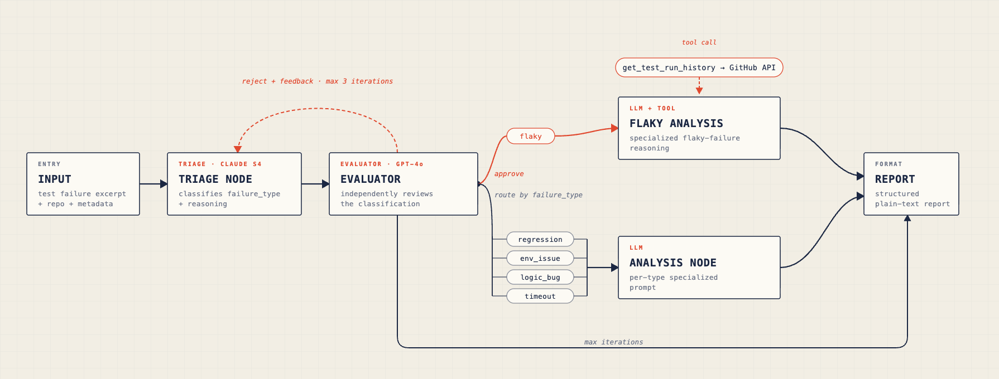

# tester-agent

An autonomous CI test failure analyst built with LangGraph. Given a test failure excerpt, the agent classifies the failure type, performs root cause analysis, and produces a structured report — routing each failure through a specialized analysis pipeline rather than treating all failures identically.

## Why an Agent and Not a Script

A script can tell you *that* a test failed. This agent reasons about *why*.

The key design decision is the conditional router: each failure type — flaky, regression, environment issue, logic bug, timeout — requires fundamentally different diagnostic reasoning. A flaky test analysis looks for non-determinism sources and calls a tool to retrieve historical run data from the GitHub Actions API. A regression analysis looks for what value changed and from what prior state. An environment issue analysis identifies the exact missing component and produces the install command. This branching logic cannot be encoded as a deterministic script without reproducing a significant subset of what the LLM does.

For flaky failures specifically, the agent makes a genuine agentic decision: if the excerpt alone does not contain clear non-determinism evidence, it calls `get_test_run_history` to retrieve pass/fail rates across recent CI runs before concluding. This is the property that distinguishes an agent from a prompt pipeline — the LLM decides what information to gather, not just what text to generate.

The triage classification is also validated by a second model before proceeding. After the triage node produces a classification, a GPT-4o evaluator node independently reviews the reasoning against the excerpt and either approves or rejects it. Rejection triggers a feedback loop where the triage node revises under criticism — up to three iterations before escalating to a low-confidence report. This reflection pattern catches the class of failures that a single-pass classifier consistently misses.

The agent is also observable in a way a script is not. Every decision — triage classification, evaluator verdict, routing choice, tool call, root cause hypothesis — is captured as a LangSmith trace with the exact prompt, model response, latency, and token cost at each node.

---

## Benchmark

Failure classification accuracy measured against 25 labelled fixtures across 5 failure types (5 per type).

| Method | Accuracy | Notes |
|---|---|---|
| Regex heuristics | 60% (12/20) | Keyword matching in `process_fixtures.py` — no reasoning |
| Single LLM prompt | 84% (16/20) | Direct JSON classification, no routing |
| Routed agent, no evaluator | 96% (24/25) | Hybrid prompt + conditional routing per failure type |
| **Routed agent + GPT-4o evaluator** | **100% (25/25)** | Reflection loop catches residual misclassifications |

The regex baseline comes from the initial label generation pass in `process_fixtures.py`. The single prompt baseline is direct JSON classification without routing. The routed agent without evaluator achieved 96% — one fixture was a CPython forkserver signal-handling test (`test_forkserver_sigkill`) that the triage node classified as `logic_bug` because the excerpt showed a bare `AssertionError` with no explicit non-determinism language. The GPT-4o evaluator rejected that classification, correctly identifying the failure as a timing-dependent cross-process synchronization test and triggering a triage revision that produced the correct `flaky` label.

---

## Architecture



### Reflection Pattern

The triage node produces a classification with a reasoning field — 2-3 sentences citing specific signals from the excerpt. The evaluator node receives both the classification and the reasoning and asks three questions:

1. Does the excerpt actually contain the signals the triage node claims to have seen?
2. Is there a more appropriate classification given the disambiguation rules?
3. Is the confidence level justified by the evidence?

On rejection, the evaluator produces structured feedback identifying what was wrong and what type it would assign instead. The triage node receives this feedback in its next prompt and must explicitly address each point. This cycle repeats up to three times. If consensus is not reached, the report node produces an `unclassified` report flagging the fixture for manual review.

The two-model design is intentional. Claude Sonnet 4 is the primary classifier; GPT-4o is the critic. Using different model families reduces the risk of shared systematic biases — a failure mode that would cause a single-model reflection loop to approve its own wrong answers.

### Tool: get_test_run_history

The flaky analysis node has access to a tool that queries the GitHub Actions API for a specific test's pass/fail history across recent runs. Rather than counting workflow-level conclusions (which reflect any failing test in the suite), the tool downloads log ZIPs for each run and searches for the specific test name, computing a per-test flaky probability.

```python
# Returns:
{
  "test_name": "test_large_content_length_truncated",
  "runs_checked": 50,
  "runs_with_test_found": 12,
  "failures": 5,
  "passes": 7,
  "flaky_probability": 0.42,
  "verdict": "flaky",
  "history": [...]   # per-run breakdown for the LLM to reason over
}
```

The LLM calls the tool only when the excerpt does not contain clear non-determinism evidence. When it does call the tool, the result feeds back into the conversation and the model produces a final classification grounded in historical evidence rather than a single excerpt.

### State

All nodes share a typed state object (`agent/state.py`):

```python
class AgentState(TypedDict):
    # Input
    raw_excerpt: str
    test_name: str
    runner: str
    timestamp: str
    repo: str                         # e.g. "python/cpython"

    # Triage output
    failure_type: Optional[str]       # flaky | regression | env_issue | logic_bug | timeout | unclassified
    triage_confidence: Optional[str]  # high | medium | low
    triage_reasoning: Optional[str]   # 2-3 sentences cited by the evaluator

    # Evaluator state
    eval_iterations: Optional[int]    # counts rejection cycles (max 3)
    evaluator_feedback: Optional[str] # critic reasoning passed back to triage

    # Analysis output
    root_cause: Optional[str]
    recommended_action: Optional[str]
    severity: Optional[str]           # critical | high | medium | low

    # Report output
    report: Optional[str]
```

---

## Prompt Engineering: Three Experiments

Triage accuracy was measured against a labelled fixture dataset of 25 examples (real CI logs from CPython + synthetic examples, 5 per failure type).

| Prompt strategy | Accuracy | Key failure |
|---|---|---|
| Direct JSON (baseline) | 84% | Weak on `logic_bug` |
| Chain-of-thought | 68% | Collapsed `flaky` into `logic_bug` |
| **Hybrid (final)** | **96% without evaluator / 100% with evaluator** | None after reflection |

**Finding:** chain-of-thought prompting improved `logic_bug` precision but destroyed `flaky` recall. Real-world flaky CI logs rarely contain explicit non-determinism language, so forced step-by-step reasoning led the model to over-classify ambiguous failures as `logic_bug`. The hybrid approach gives each failure type an explicit signal vocabulary without triggering the over-reasoning that hurt flaky classification.

The residual 4% error (one fixture) was a CPython multiprocessing signal-handling test that consistently fooled the triage node across all prompt strategies, because the excerpt genuinely lacked flakiness signals — the failure mechanism was only apparent from understanding what the test was doing, not from reading the error message. The GPT-4o evaluator caught it by reasoning about the test name and the nature of `SIGKILL` handling rather than just the `AssertionError` text.

**Ground truth validation finding:** the initial regex-based labeller agreed with LLM-validated ground truth on approximately 60% of fixtures. Several CPython failures were initially mislabelled as `logic_bug` but correctly reclassified as `flaky` — sampling profiler tests checking statistical properties of concurrent stack traces, threading Barrier synchronization failures, temp directory race conditions, and forkserver signal-handling tests. None contained explicit non-determinism language. This pattern motivated replacing regex classification with LLM classification in `process_fixtures.py` and establishing a manual validation step for any fixture the LLM labels with low confidence.

---

## Fixture Dataset

The evaluation dataset lives in `fixtures/processed/` — 15 JSON files, 3 per failure type.

```
fixtures/
  processed/
    flaky/       ← 6 fixtures (real CI logs, LLM-relabelled)
    regression/  ← 5 fixtures (4 real CI log + 1 synthetic)
    env_issue/   ← 5 fixtures (real CI logs)
    logic_bug/   ← 4 fixtures (real CI logs)
    timeout/     ← 5 fixtures (real CI logs)
  raw/           ← original GitHub Actions logs (gitignored)
```

Each fixture:

```json
{
  "failure_type": "flaky",
  "repo": "python/cpython",
  "runner": "github-actions",
  "timestamp": "2026-05-29T15:17:11Z",
  "test_name": "test_large_content_length_truncated",
  "source_run_id": 14823749201,
  "source_file": "3_Run tests.txt",
  "raw_excerpt": "..."
}
```

Raw logs were downloaded from the CPython GitHub Actions API using `downloader.py`. Initial labels were generated by LLM classification in `process_fixtures.py` (replacing an earlier regex approach that achieved only 60% label accuracy). Fixtures that were ambiguous or too noisy to classify confidently were replaced with synthetic examples that have unambiguous signal. The `repo` field travels with each fixture through the agent state, allowing the `get_test_run_history` tool to query the correct repository without hardcoding.

---

## Project Structure

```
tester-agent/
  agent/
    __init__.py
    state.py            ← shared AgentState TypedDict
    nodes.py            ← triage_node (hybrid prompt, accepts evaluator feedback)
    analysis.py         ← flaky_analysis_node (tool calling) + analysis_node (per-type prompts)
    evaluator.py        ← evaluator_node (GPT-4o critic) + evaluator_route
    report.py           ← report_node (handles unclassified case)
    graph.py            ← LangGraph graph with conditional routing + reflection loop
  fixtures/
    processed/          ← labelled eval dataset (committed)
    raw/                ← raw CI logs (gitignored)
  downloader.py         ← GitHub Actions log downloader
  process_fixtures.py   ← ETL: raw logs → LLM-labelled fixtures
  explain_fixtures.py   ← LLM-based label validation
  run_agent.py          ← single fixture runner
  eval.py               ← accuracy measurement across all fixtures
  pyproject.toml
  .env_example
```

---

## Local Setup

**Requirements:** Python 3.12+, [uv](https://github.com/astral-sh/uv), Anthropic API key, OpenAI API key, GitHub token, LangSmith API key (optional but recommended).
```bash
git clone https://github.com/youruser/tester-agent
cd tester-agent

# Install dependencies
uv sync

# Configure environment
cp .env_example .env
# Edit .env and add your keys

# Run against a single fixture
uv run python run_agent.py

# Run full eval
uv run python eval.py
```

**.env_example:**

```
ANTHROPIC_API_KEY=sk-ant-...
GITHUB_TOKEN=ghp_...
LANGCHAIN_API_KEY=ls__...
LANGCHAIN_TRACING_V2=true
LANGCHAIN_PROJECT=tester-agent
```

---

## Example Output

The following report was produced for a real CPython CI failure. The agent identified a race condition in an HTTP server test, called `get_test_run_history` to verify historical flakiness, and produced a concrete remediation with file and line reference.


---

## Observability

All runs are traced in LangSmith with per-node visibility into inputs, outputs, latency, and token usage. For a flaky failure that required one evaluator rejection cycle before approval, the trace shows:


The reflection loop is fully transparent in LangSmith — you can inspect the evaluator's rejection reasoning and the triage node's revised response side by side, making it straightforward to identify systematic classification weaknesses and improve the prompts.

---

## Stack

- [LangGraph](https://github.com/langchain-ai/langgraph) — agent graph, state management, conditional routing, reflection loop, tool calling
- [LangChain Anthropic](https://github.com/langchain-ai/langchain) — Claude Sonnet 4 (triage + analysis)
- [LangChain OpenAI](https://github.com/langchain-ai/langchain) — GPT-4o (evaluator)
- [LangSmith](https://smith.langchain.com) — tracing and observability
- [uv](https://github.com/astral-sh/uv) — dependency management
- Python 3.12
