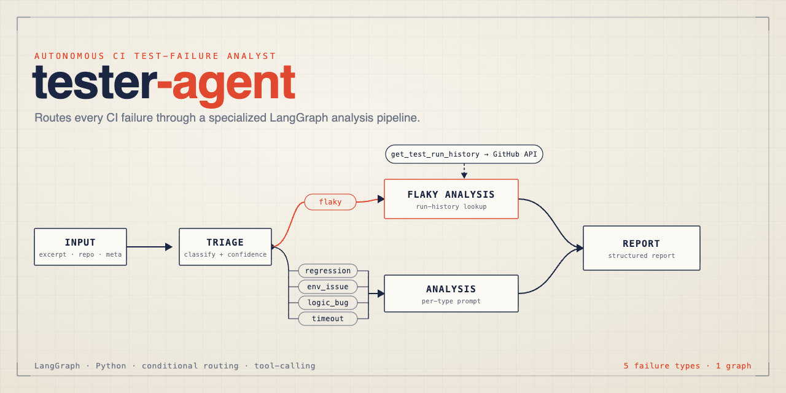
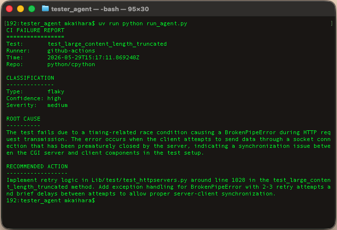
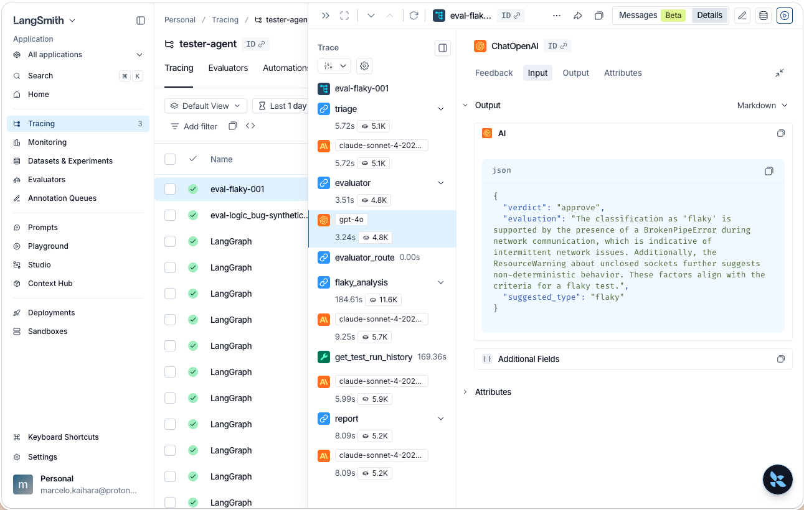

# tester-agent

An autonomous CI test failure analyst built with LangGraph. Given a test failure excerpt, the agent classifies the failure type, performs root cause analysis, and produces a structured report — routing each failure through a specialized analysis pipeline rather than treating all failures identically.

## Why an Agent and Not a Script

A script can tell you *that* a test failed. This agent reasons about *why*.

The key design decision is the conditional router: each failure type — flaky, regression, environment issue, logic bug, timeout — requires fundamentally different diagnostic reasoning. A flaky test analysis looks for non-determinism sources and calls a tool to retrieve historical run data from the GitHub Actions API. A regression analysis looks for what value changed and from what prior state. An environment issue analysis identifies the exact missing component and produces the install command. This branching logic cannot be encoded as a deterministic script without reproducing a significant subset of what the LLM does.

For flaky failures specifically, the agent makes a genuine agentic decision: if the excerpt alone does not contain clear non-determinism evidence, it calls `get_test_run_history` to retrieve pass/fail rates across recent CI runs before concluding. This is the property that distinguishes an agent from a prompt pipeline — the LLM decides what information to gather, not just what text to generate.

The agent is also observable in a way a script is not. Every decision — triage classification, routing choice, tool call, root cause hypothesis — is captured as a LangSmith trace with the exact prompt, model response, latency, and token cost at each node.

---

## Benchmark

Failure classification accuracy measured against 15 labelled fixtures across 5 failure types.

| Method | Accuracy | Notes |
|---|---|---|
| Regex heuristics | 60% (9/15) | Keyword matching in `process_fixtures.py` — no reasoning |
| Single LLM prompt | 84% (16/20) | Direct JSON classification, no routing |
| **Routed agent (this project)** | **100% (15/15)** | Hybrid prompt + conditional routing per failure type |

The regex baseline comes from the initial label generation pass in `process_fixtures.py` — approximately 60% of its labels agreed with LLM-validated ground truth, establishing it as the floor. The single prompt baseline is the direct JSON triage prompt without per-type routing. The routed agent combines a hybrid triage prompt with specialized analysis nodes per failure type, plus tool calling for flaky failures.

---

## Architecture

```
Input (test failure excerpt + repo + metadata)
        │
        ▼
┌───────────────┐
│  Triage Node  │  Classifies failure type + confidence
└───────┬───────┘
        │
        ▼ (conditional routing by failure_type)
        │
        ├─── flaky ──────► ┌────────────────────────────┐
        │                  │     Flaky Analysis Node    │
        │                  │    + get_test_run_history  │ ← tool call to GitHub API
        │                  └───────────────────────┬────┘
        │                                          │
        │                    Per-type specialized  │
        ├─── regression ─►          prompt         │
        ├─── env_issue ──►  ┌───────────────────┐  │
        ├─── logic_bug ──►  │   Analysis Node   │  │
        └─── timeout ────►  └─────────┬─────────┘  │
                                      │            │   
                                      ▼            ▼
                            ┌─────────────────────────┐
                            │       Report Node       │  Structured plain-text report
                            └─────────────────────────┘
```

### Tool: get_test_run_history

The flaky analysis node has access to a tool that queries the GitHub Actions API for a specific test's pass/fail history across recent runs. Rather than counting workflow-level conclusions (which reflect any failing test in the suite), the tool downloads log ZIPs for each run and searches for the specific test name, computing a per-test flaky probability.

```python
# Returns:
{
  "test_name": "test_large_content_length_truncated",
  "runs_checked": 50,
  "runs_with_test_found": 12,
  "failures": 5,
  "passes": 7,
  "flaky_probability": 0.42,
  "verdict": "flaky",
  "history": [...]   # per-run breakdown for the LLM to reason over
}
```

The LLM calls the tool only when the excerpt does not contain clear non-determinism evidence. When it does call the tool, the result feeds back into the conversation and the model produces a final classification grounded in historical evidence rather than a single excerpt.

### State

All nodes share a typed state object (`agent/state.py`):

```python
class AgentState(TypedDict):
    # Input
    raw_excerpt: str
    test_name: str
    runner: str
    timestamp: str
    repo: str                         # e.g. "python/cpython"

    # Triage output
    failure_type: Optional[str]       # flaky | regression | env_issue | logic_bug | timeout
    triage_confidence: Optional[str]  # high | medium | low

    # Analysis output
    root_cause: Optional[str]
    recommended_action: Optional[str]
    severity: Optional[str]           # critical | high | medium | low

    # Report output
    report: Optional[str]
```

---

## Prompt Engineering: Three Experiments

Triage accuracy was measured against a labelled fixture dataset (real CI logs from CPython + synthetic examples).

| Prompt strategy | Accuracy | Key failure |
|---|---|---|
| Direct JSON (baseline) | 84% | Weak on `logic_bug` |
| Chain-of-thought | 68% | Collapsed `flaky` into `logic_bug` |
| **Hybrid (final)** | **100%** | None |

**Finding:** chain-of-thought prompting improved `logic_bug` precision but destroyed `flaky` recall. Real-world flaky CI logs rarely contain explicit non-determinism language, so forced step-by-step reasoning led the model to over-classify ambiguous failures as `logic_bug`. The hybrid approach gives each failure type an explicit signal vocabulary without triggering the over-reasoning that hurt flaky classification.

The hybrid prompt structure per failure type:

```
- type definition
- what to look for (specific error classes, keywords, patterns)
- disambiguation rules (when to prefer one type over another)
- severity criteria (explicit anchors, not vague descriptions)
```

**Ground truth validation finding:** the initial regex-based labeller in `process_fixtures.py` agreed with LLM-validated ground truth on approximately 60% of fixtures. Three real CPython CI failures initially labelled as `logic_bug` and `env_issue` were correctly reclassified as `flaky` after manual inspection — a sampling profiler test checking statistical properties of concurrent stack traces, a threading Barrier synchronization failure, and a temp directory race condition between parallel test workers. None of these contained explicit non-determinism language, which is why the regex classifier failed. This finding motivated replacing regex classification with LLM classification in `process_fixtures.py`.

---

## Fixture Dataset

The evaluation dataset lives in `fixtures/processed/` — 15 JSON files, 3 per failure type.

```
fixtures/
  processed/
    flaky/       ← 3 fixtures (real CI logs, LLM-relabelled)
    regression/  ← 3 fixtures (1 real CI log + 2 synthetic)
    env_issue/   ← 3 fixtures (synthetic)
    logic_bug/   ← 3 fixtures (synthetic)
    timeout/     ← 3 fixtures (real CI logs + synthetic)
  raw/           ← original GitHub Actions logs (gitignored)
```

Each fixture:

```json
{
  "failure_type": "flaky",
  "repo": "python/cpython",
  "runner": "github-actions",
  "timestamp": "2026-05-29T15:17:11Z",
  "test_name": "test_large_content_length_truncated",
  "source_run_id": 14823749201,
  "source_file": "3_Run tests.txt",
  "raw_excerpt": "..."
}
```

Raw logs were downloaded from the CPython GitHub Actions API using `downloader.py`. Initial labels were generated by LLM classification in `process_fixtures.py` (replacing an earlier regex approach that achieved only 60% label accuracy). Fixtures that were ambiguous or too noisy to classify confidently were replaced with synthetic examples that have unambiguous signal. The `repo` field travels with each fixture through the agent state, allowing the `get_test_run_history` tool to query the correct repository without hardcoding.

---

## Project Structure

```
tester-agent/
  agent/
    __init__.py
    state.py            ← shared AgentState TypedDict
    nodes.py            ← triage_node (hybrid prompt)
    analysis.py         ← flaky_analysis_node (tool calling) + analysis_node (per-type prompts)
    report.py           ← report_node
    graph.py            ← LangGraph graph with conditional routing
  fixtures/
    processed/          ← labelled eval dataset (committed)
    raw/                ← raw CI logs (gitignored)
  downloader.py         ← GitHub Actions log downloader
  process_fixtures.py   ← ETL: raw logs → LLM-labelled fixtures
  explain_fixtures.py   ← LLM-based label validation
  run_agent.py          ← single fixture runner
  eval.py               ← accuracy measurement across all fixtures
  pyproject.toml
  .env.example
```

---

## Local Setup

**Requirements:** Python 3.12+, [uv](https://github.com/astral-sh/uv), Anthropic API key, GitHub token, LangSmith API key (optional but recommended).

```bash
git clone https://github.com/youruser/tester-agent
cd tester-agent

# Install dependencies
uv sync

# Configure environment
cp .env_example .env
# Edit .env and add your keys

# Run against a single fixture
uv run python run_agent.py

# Run full eval
uv run python eval.py
```

**.env_example:**

```
ANTHROPIC_API_KEY=sk-ant-...
GITHUB_TOKEN=ghp_...
LANGCHAIN_API_KEY=ls__...
LANGCHAIN_TRACING_V2=true
LANGCHAIN_PROJECT=tester-agent
```

---

## Example Output

The following report was produced for a real CPython CI failure. The agent identified a race condition in an HTTP server test, called `get_test_run_history` to verify historical flakiness, and produced a concrete remediation with file and line reference.



---

## Observability

All runs are traced in LangSmith with per-node visibility into inputs, outputs, latency, and token usage. For a flaky failure where the agent calls the tool, the trace shows:



```
LangGraph  153.19s  ~20.5K tokens / $0.07
  ├── triage                        3.33s   input: raw_excerpt → output: failure_type, confidence
  ├── route_by_failure_type         0.00s
  ├── flaky_analysis              142.86s
  │     ├── ChatAnthropic           4.12s   initial analysis + tool call decision
  │     ├── get_test_run_history  132.30s   GitHub API — downloads logs for 50 runs
  │     └── ChatAnthropic           6.44s   final classification with history evidence
  └── report                        7.00s   input: full state → output: structured report
```

The `get_test_run_history` step dominates latency because it downloads and searches log ZIPs for each of the 50 lookback runs. This is expected — the tool is called only when the excerpt alone is insufficient, and the added evidence qualitatively improves the root cause hypothesis.

---

## Stack

- [LangGraph](https://github.com/langchain-ai/langgraph) — agent graph, state management, conditional routing, tool calling
- [LangChain Anthropic](https://github.com/langchain-ai/langchain) — Claude Sonnet 4 integration
- [LangSmith](https://smith.langchain.com) — tracing and observability
- [uv](https://github.com/astral-sh/uv) — dependency management
- Python 3.12
